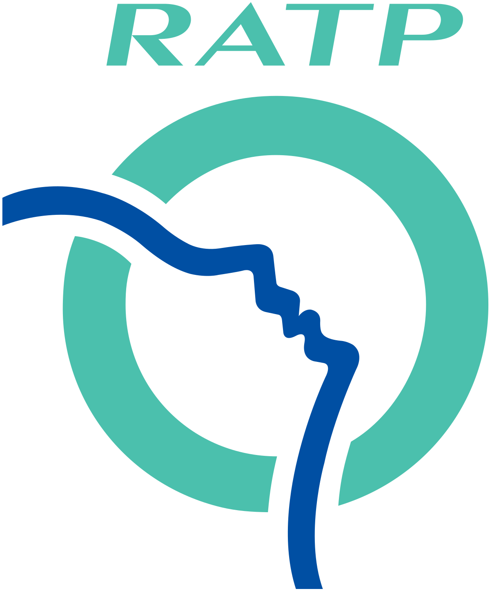

 
  

<h1 align="center"> Paris metro simulation </h1>
<h3 align="center"> IA04 - Multi Agent Systems </h3>
<h5 align="center"> Project Assignment - <a href="https://www.utc.fr/">Université de Technologie de Compiègne</a> (Spring 2021) </h5>

 

We developped a simulation of the whole parisian subway.
It includes simulation of subway train, traveller pathfinding, station failure, etc. 

<h2> :floppy_disk: Project Files Description</h2>

There are 4 main directories for this projet:

<ul>
  <li><b>data directory</b> - Includes all cleaned data originaly from <a href="https://data.iledefrance-mobilites.fr/pages/home/">IDFM Open Data</a> .</li>
  <li><b>img directory</b> - Includes all logo used in this documentation.</li>
  <li><b>lib directory</b> - Includes all libraries used in our project. None of these belong to us.</li>
  <li><b>src directory</b> - Includes all java files.</li>
</ul>

<h2> :clipboard: Dependencies</h2>

 We used <a href="https://cs.gmu.edu/~eclab/projects/mason/"> Mason</a> for this project. 

 From their website: "MASON is a fast discrete-event multiagent simulation library core in Java, designed to be the foundation for large custom-purpose Java simulations, and also to provide more than enough functionality for many lightweight simulation needs. 
MASON contains both a model library and an optional suite of visualization tools in 2D and 3D." 

<!-- CREDITS -->
<h2 id="credits"> :scroll: Credits</h2>

Raphael Jaures:

Yvain Raynaud:

